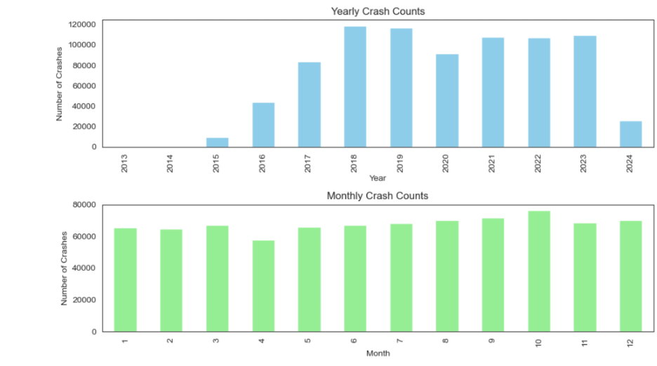
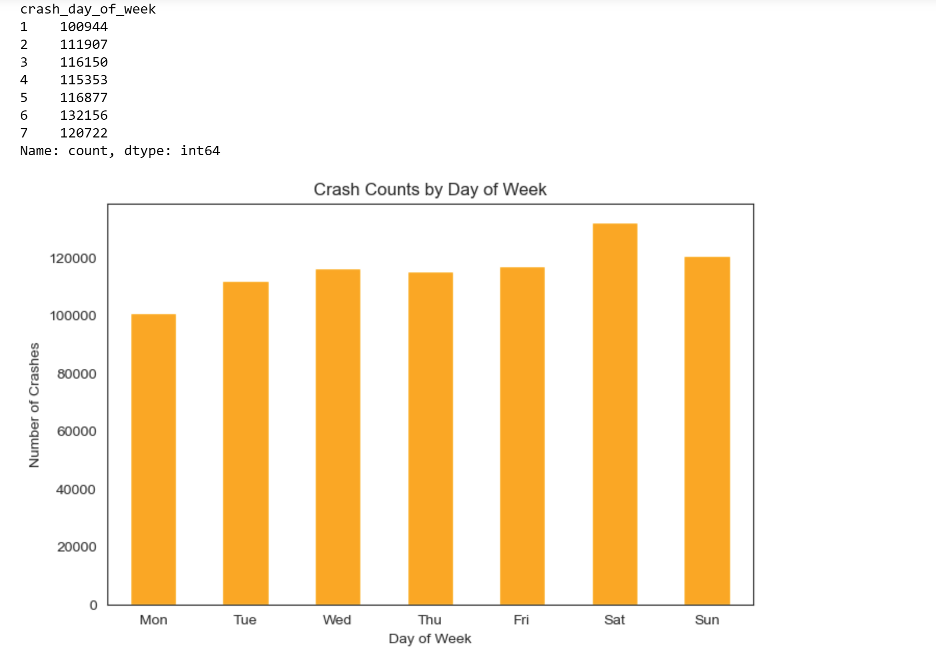
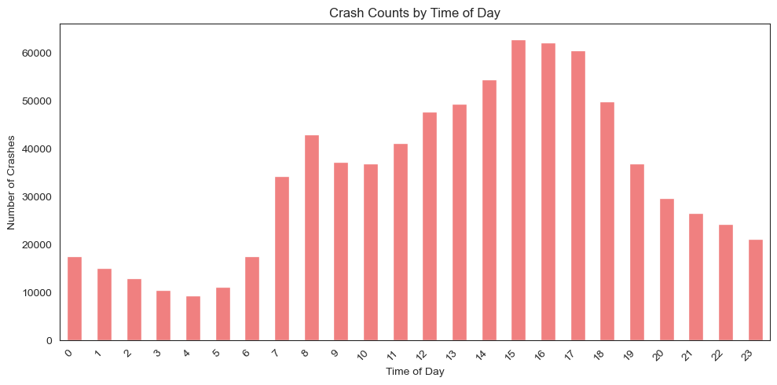
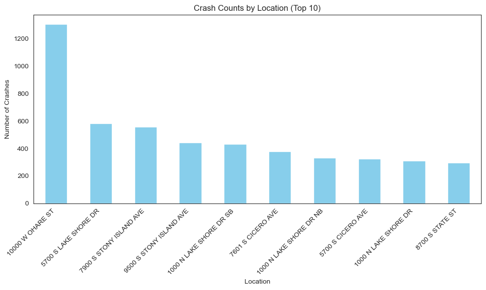
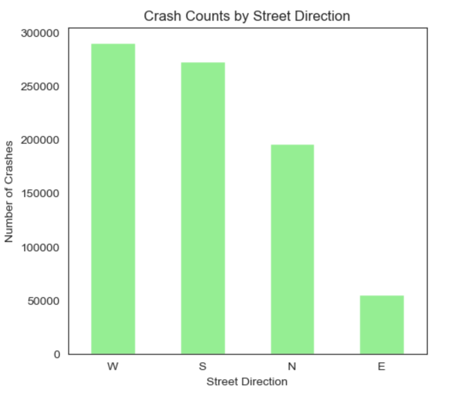

## 1. Project Title - Chicago Traffic Crash Analysis and Modeling

- Prepared for UMBC Data Science Master Degree Capstone by Dr Chaoji (Jay) Wang - Fall 2024 Semester
- Author: Vamshi Konapuram
- GitHub : https://github.com/vamshi4h2
- Linkedin : https://www.linkedin.com/in/vamshi-konapuram-2640b11a1/
- Presentation :
- YouTube : https://youtu.be/c4tnohPq_Xk

## 2. Background
### 2.1 What is it about? 
This project aims to analyze traffic crashes in Chicago to better understand the factors influencing accident rates, severity, and patterns. By examining temporal, spatial, environmental, and human factors, the project seeks to identify trends and correlations that can help improve traffic safety. The analysis will also explore demographic patterns, the relationship between traffic volume, speed limits, and accident hotspots.
### 2.2 Why does it matter? 
Traffic accidents are a major public health and safety issue, especially in large urban areas like Chicago. Understanding the dynamics of traffic crashes is crucial for reducing fatalities and injuries, improving road safety, and optimizing urban planning. Insights from this project can inform evidence-based policies, improve law enforcement strategies, and enhance the design of transportation infrastructure. The goal is to reduce accident rates and advance sustainable transportation options for the city and other similar urban centers.

### 2.3 Research Questions:
1. What are the temporal patterns (yearly, monthly, and daily) of traffic crashes in Chicago?
2. How do environmental factors (weather, lighting, road conditions) contribute to traffic accidents?
3. What are the demographic correlations in traffic crashes, and how do human factors (e.g., driver behavior, alcohol involvement) influence accident severity?
4. Can spatial analysis identify accident hotspots, and how do traffic volume and speed limits relate to crash rates?
5. How can the findings support the creation of effective traffic safety programs and policy initiatives?

## 3. DATA
Description : 

1. Data Source : *[Chicago Data Portal](https://data.cityofchicago.org/Transportation/Traffic-Crashes-Crashes/85ca-t3if/data)*. :link:

2. Data Size : 472 MB

3. Data Shape
   > - Number of columns =  47
   > - Number of rows    = 872078

4. Time period (2014 - 2024)
5. What does dataset represent - The Traffic Crashes dataset from the City of Chicago includes detailed records of traffic incidents, capturing crash location, date, and time, along with conditions like weather, road surface, and traffic control. It also provides data on crash types, contributing factors, damage, and injuries, enabling analysis of traffic safety and patterns.

6. Data Dictionary
   
### 3.1 Data Dictionary

| **Column Name**                        | **Definition**                                                                    |
|----------------------------------------|------------------------------------------------------------------------------------|
| `CRASH_RECORD_ID`                      | Unique identifier for each traffic crash record.                                   |
| `CRASH_DATE_EST_I`                     | Indicates whether the crash date is an estimate.                                   |
| `CRASH_DATE`                           | Actual date and time when the crash occurred.                                      |
| `POSTED_SPEED_LIMIT`                   | Speed limit posted at the crash location.                                          |
| `TRAFFIC_CONTROL_DEVICE`               | Type of traffic control device present at the crash location.                      |
| `DEVICE_CONDITION`                     | Condition of the traffic control device.                                           |
| `WEATHER_CONDITION`                    | Weather conditions at the time of the crash.                                       |
| `LIGHTING_CONDITION`                   | Lighting conditions during the crash.                                              |
| `FIRST_CRASH_TYPE`                     | The first harmful event in the crash.                                              |
| `TRAFFICWAY_TYPE`                      | Type of trafficway where the crash occurred.                                       |
| `LANE_CNT`                             | Number of lanes at the crash location.                                             |
| `ALIGNMENT`                            | The alignment of the road where the crash occurred.                                |
| `ROADWAY_SURFACE_COND`                 | Condition of the road surface during the crash.                                    |
| `ROAD_DEFECT`                          | Any road defects that contributed to the crash.                                    |
| `REPORT_TYPE`                          | Type of report filed for the crash.                                                |
| `CRASH_TYPE`                           | The overall classification of the crash.                                           |
| `INTERSECTION_RELATED_I`               | Whether the crash was intersection-related.                                        |
| `NOT_RIGHT_OF_WAY_I`                   | Indicates failure to yield the right of way.                                       |
| `HIT_AND_RUN_I`                        | Whether the crash involved a hit-and-run.                                          |
| `DAMAGE`                               | The level of damage caused by the crash.                                           |
| `DATE_POLICE_NOTIFIED`                 | Date and time when the police were notified of the crash.                          |
| `PRIM_CONTRIBUTORY_CAUSE`              | Primary cause contributing to the crash.                                           |
| `SEC_CONTRIBUTORY_CAUSE`               | Secondary cause contributing to the crash (if applicable).                         |
| `STREET_NO`                            | Street number where the crash occurred.                                            |
| `STREET_DIRECTION`                     | Direction of the street where the crash occurred.                                  |
| `STREET_NAME`                          | Name of the street where the crash occurred.                                       |
| `BEAT_OF_OCCURRENCE`                   | Police beat where the crash occurred.                                              |
| `PHOTOS_TAKEN_I`                       | Indicates whether photos were taken at the crash scene.                            |
| `STATEMENTS_TAKEN_I`                   | Indicates whether statements were taken at the scene.                              |
| `DOORING_I`                            | Whether the crash involved dooring (when a car door opens into a cyclist's path).   |
| `WORK_ZONE_I`                          | Whether the crash occurred in a work zone.                                         |
| `WORK_ZONE_TYPE`                       | Type of work zone (if applicable).                                                 |
| `WORKERS_PRESENT_I`                    | Whether workers were present in the work zone.                                     |
| `NUM_UNITS`                            | Number of units involved in the crash (e.g., vehicles, pedestrians).               |
| `MOST_SEVERE_INJURY`                   | Most severe injury recorded in the crash.                                          |
| `INJURIES_TOTAL`                       | Total number of injuries resulting from the crash.                                 |
| `INJURIES_FATAL`                       | Total number of fatal injuries.                                                    |
| `INJURIES_INCAPACITATING`              | Total number of incapacitating injuries.                                           |
| `INJURIES_NON_INCAPACITATING`          | Total number of non-incapacitating injuries.                                       |
| `INJURIES_REPORTED_NOT_EVIDENT`        | Total number of reported but not evident injuries.                                 |
| `INJURIES_NO_INDICATION`               | Total number of people involved with no indication of injury.                      |
| `INJURIES_UNKNOWN`                     | Total number of unknown injuries.                                                  |
| `CRASH_HOUR`                           | The hour of the day when the crash occurred.                                       |
| `CRASH_DAY_OF_WEEK`                    | The day of the week when the crash occurred.                                       |
| `CRASH_MONTH`                          | The month when the crash occurred.                                                 |
| `LATITUDE`                             | Latitude coordinate of the crash location.                                         |
| `LONGITUDE`                            | Longitude coordinate of the crash location.                                        |
| `LOCATION`                             | Combined latitude and longitude in a human-readable format.                        |

### 3.2 Target Variables

- **`has_injuries`**: Indicates whether the crash resulted in any injuries (1 = Yes, 0 = No).
- **`has_fatal`**: Indicates whether the crash resulted in any fatalities (1 = Yes, 0 = No).
- **`crash_type`**: The overall type or classification of the crash (e.g., vehicle collision, pedestrian).
- **`damage`**: The extent of damage caused by the crash (e.g., minor, major, total).
- **`injuries_total`**: Total number of injuries sustained as a result of the crash.
- **`injuries_fatal`**: Total number of fatal injuries sustained as a result of the crash.

### 3.3 Selected Features/Predictors for the ML Models

The following columns are selected as features (predictors) to train the ML models:
- **`crash_date`**: The date when the crash occurred.
- **`crash_year`**: The year of the crash.
- **`crash_month`**: The month in which the crash occurred.
- **`crash_day_of_week`**: The day of the week when the crash occurred (e.g., Monday, Tuesday, etc.).
- **`crash_hour`**: The hour of the day when the crash occurred.
- **`crash_time_of_day`**: Describes the time of day during which the crash occurred (e.g., morning, night).
- **`latitude`**: Latitude coordinate of the crash location.
- **`longitude`**: Longitude coordinate of the crash location.
- **`beat_of_occurrence`**: The police beat where the crash occurred.
- **`address`**: The street address where the crash occurred.
- **`street_no`**: The street number where the crash occurred.
- **`street_direction`**: The direction of the street where the crash occurred (e.g., N, S, E, W).
- **`street_name`**: The name of the street where the crash occurred.
- **`posted_speed_limit`**: The speed limit posted on the street where the crash occurred.
- **`traffic_control_device`**: The traffic control device in place at the location of the crash (e.g., stop sign, signal).
- **`device_condition`**: The condition of the traffic control device at the time of the crash.
- **`weather_condition`**: The weather condition at the time of the crash (e.g., clear, rain, snow).
- **`lighting_condition`**: The lighting conditions during the crash (e.g., daylight, dark, streetlights on).
- **`trafficway_type`**: The type of trafficway involved in the crash (e.g., divided, undivided).
- **`alignment`**: The alignment of the road where the crash occurred (e.g., straight, curve).
- **`roadway_surface_cond`**: The condition of the road surface at the time of the crash (e.g., dry, wet).
- **`road_defect`**: Any defects present in the road at the time of the crash (e.g., potholes).
- **`first_crash_type`**: The first harmful event or crash type that occurred (e.g., collision with a vehicle).
- **`prim_contributory_cause`**: The primary cause contributing to the crash (e.g., speeding, failure to yield).
- **`sec_contributory_cause`**: The secondary cause contributing to the crash.
- **`num_units`**: The number of units (vehicles or persons) involved in the crash.

## 4. Methodology:
### Anova test and Tukey’s test
In order to analyze the variance in crash frequencies, we used ANOVA and Tukey's Honestly Significant Difference (HSD) tests to look at the temporal trends of traffic crashes in Chicago over a period of years. With a p-value close to zero and a very significant F-statistic of 1535.181, the ANOVA findings showed significant variations in the number of crashes between various years. This implies that the average annual crash rate fluctuates, underscoring the impact of changing circumstances throughout time.

Tukey's HSD test was used to further analyze the data to find particular years, especially 2024, that significantly deviated from the rest. These differences may indicate abnormal trends or impacts resulting from outside influences like modifications to traffic laws, improvements to urban infrastructure, or noteworthy social events. These results highlight the need for continuous observation and focused interventions in years that are statistically distinct in order to improve road safety and successfully lower crash rates.

### Chi2test
A highly significant statistical link between collision types and key contributory reasons in traffic events was found by using the Chi-square test. The results showed a Chi-square statistic of 1,075,594.2335 with a p-value of almost zero. This implies that particular crash kinds are more likely to happen when certain contributing factors are present than would be predicted by chance alone. The research highlights the possibility for focused interventions and policy formulations that address common contributing factors to lower the incidence and severity of traffic crashes. The analysis is based on a contingency table with 663 degrees of freedom.

## 5. Exploratory Data Analysis(EDA)
### 4.1 Data Cleansing and Preparation

Data cleansing and preparation is a vital step in transforming raw data into a format suitable for analysis. In this project, we worked with traffic crash data from the Chicago Data Portal, starting by loading and inspecting the raw dataset to identify missing values and assess its structure. We renamed several columns to create more concise and meaningful labels and dropped irrelevant fields like `LOCATION` and `LANE_CNT` to reduce noise. To handle missing values, we filled certain columns, such as `intersection_related_i` and `hit_and_run_i`, with default values of "N" for non-occurrence. Where crash type was categorized as "NO INJURY / DRIVE AWAY," missing injury-related columns were filled with zeros, and rows with critical missing data were removed.

The dataset was further standardized by converting date columns to a datetime format and extracting the crash year. Address fields were combined to create a single address column, ensuring consistency across location data. We also removed rows with invalid coordinates (latitude and longitude values of zero) to maintain the integrity of location-based analysis. Duplicate rows were retained, as they may represent repeated crash reports with the same characteristics.

Next, feature engineering was performed by rounding the posted speed limit to the nearest five and creating new binary features such as `has_injuries` and `has_fatal` to indicate whether a crash involved injuries or fatalities. We also categorized the time of day into periods (overnight, morning, mid-day, evening) based on the hour of the crash. Following final cleaning steps to handle any remaining inconsistencies, the data was saved to CSV files, ready for further analysis. This cleansing process improved data quality, ensured consistency, and created meaningful features that enhanced the dataset’s analytical value.

### 4.2 Data Visualization

#### Temporal Trends
*Is there a significant difference in the number of crashes across different years or months?*

**Monthly Crash Counts**

**Crash Counts by Time of Day**

#### Geographical Analysis:
*Are there specific locations (addresses, beats, or areas) where crashes are more prevalent?*

#### Directional Analysis

## 6. Machine Learning Models

We used a number of classification techniques, such as SGD Classifier, ADA Boost, Gradient Boost, Random Forest, and Bagging. We also looked into using PCA and kernel approximation to improve the performance of the models.

| Model           | Accuracy | F1 Score | Recall | Precision | Balanced Accuracy | ROC AUC |
|-----------------|----------|----------|--------|-----------|-------------------|---------|
| SGD Classifier  | 74%      | 0.43     | 0.71   | 0.74      | 0.73              | 0.82    |
| ADA Boost       | 80%      | 0.46     | 0.63   | 0.36      | 0.73              | 0.82    |
| Gradient Boost  | 89%      | 0.40     | 0.28   | 0.71      | 0.63              | 0.82    |
| Random Forest   | 81%      | 0.45     | 0.58   | 0.37      | 0.71              | 0.81    |
| Bagging         | 84%      | 0.44     | 0.47   | 0.41      | 0.69              | 0.79    |

Out of all the methods that were examined, Gradient Boost had the greatest accuracy. 
With an F1 score of 0.40, the Gradient Boost model obtained an accuracy score of 0.89 on the test set. Similar results are obtained for the model with an F1 score of 0.40 and a balanced accuracy of 0.63 on the validation set.

## 7. Streamlit Deployment

Streamlit is an open-source Python library that enables you to create interactive web applications for machine learning, data science, and other tasks with minimal effort. It simplifies the process of building data-driven web apps by allowing you to write Python scripts that automatically transform into interactive web applications.

## 8. Conclusion:

This project provides a detailed analysis of Chicago’s traffic crash data, identifying key temporal and spatial patterns to inform targeted safety measures. Findings reveal peak crash times, notably midday and late afternoons on Fridays, as well as accident hotspots across the city. Statistical tests confirmed significant correlations, and the Gradient Boost model achieved high predictive accuracy, supporting proactive crash management. These insights offer real-world applications for policymakers in urban planning and traffic safety, suggesting targeted interventions to reduce crashes. Ultimately, this data-driven approach aims to enhance road safety in Chicago, with broader applications for other cities facing similar challenges.

